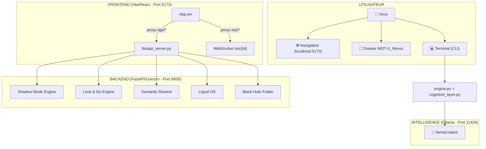
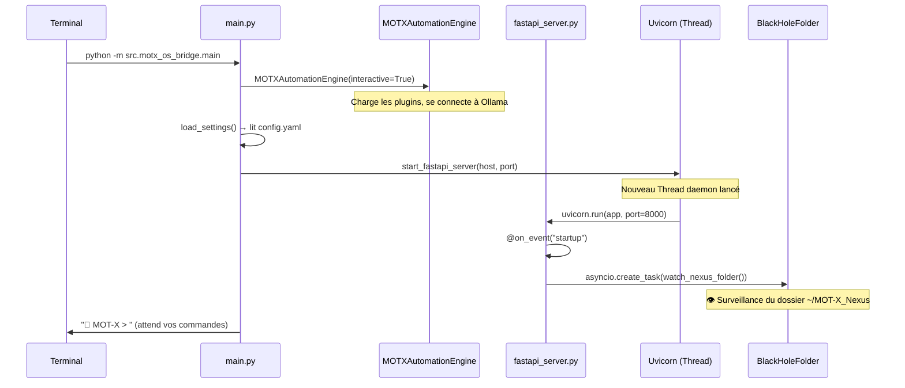
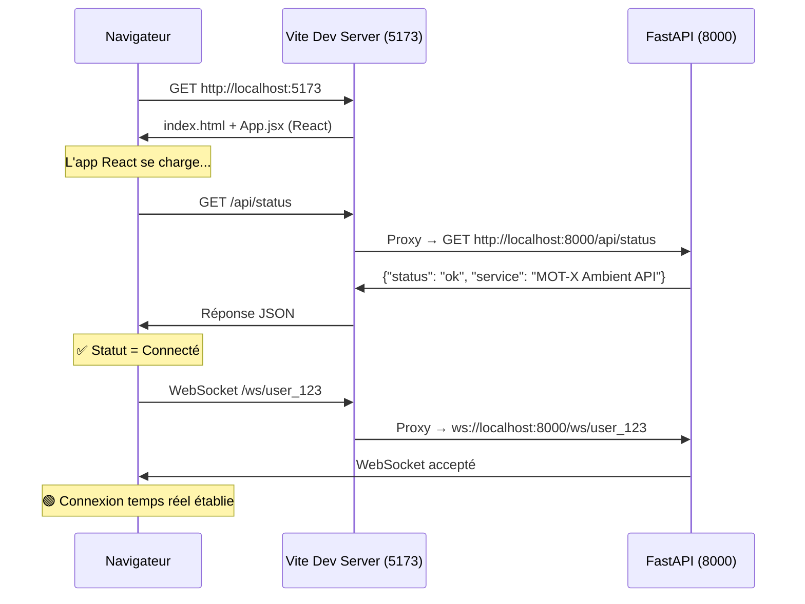
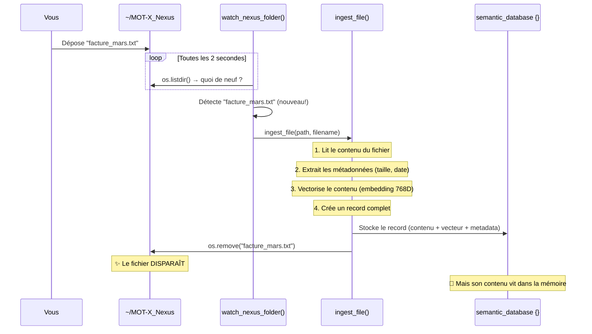
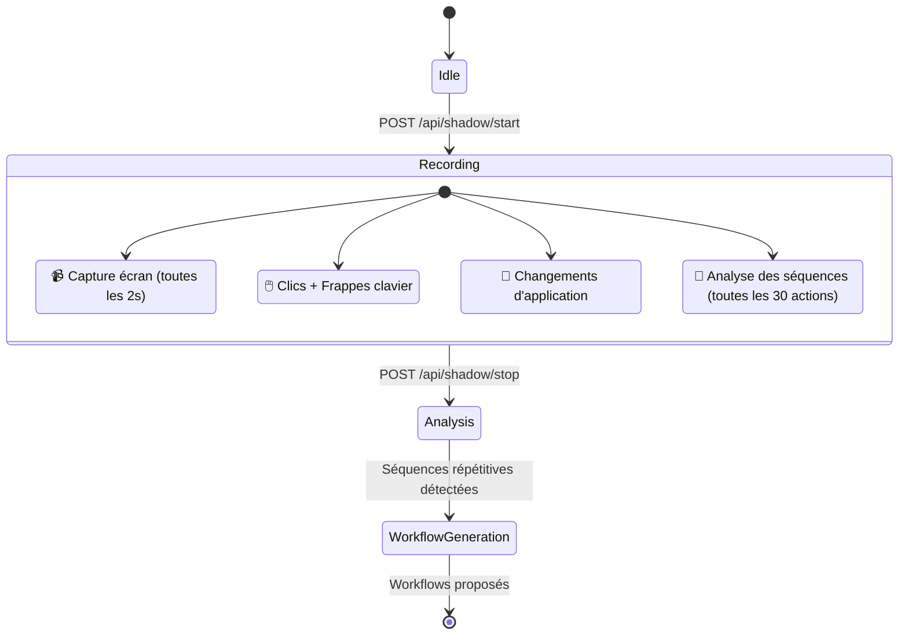
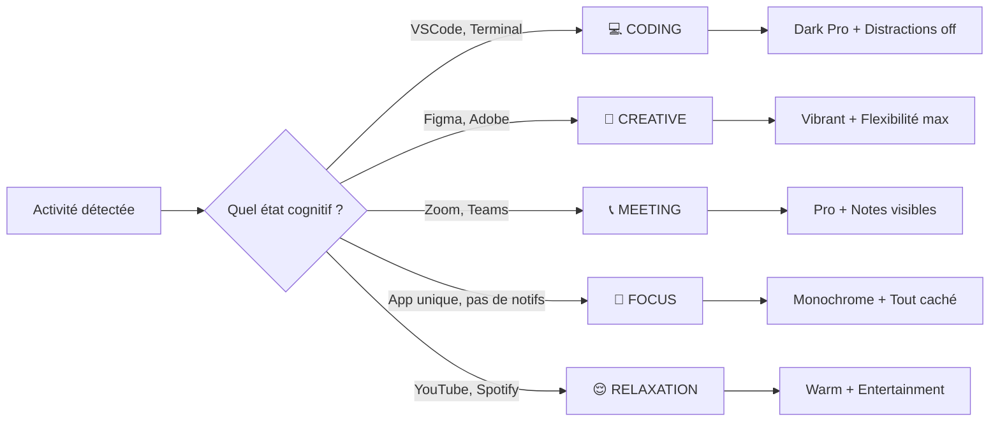
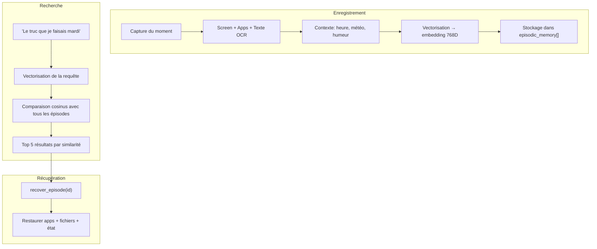

# MOT-X OS — Fonctionnement Pas à Pas

## 🏗️ Architecture Globale



---

## Étape 1 : Le Démarrage

Quand vous lancez `python -m src.motx_os_bridge.main`, voici ce qui se passe :



**En résumé :**
1. `main.py` crée le moteur d'automatisation et se connecte à Ollama (LLM local).
2. Il lance **FastAPI dans un thread séparé** via Uvicorn sur le port 8000.
3. Au démarrage de FastAPI, le **Black Hole Folder** commence à surveiller `~/MOT-X_Nexus` en arrière-plan.
4. Le terminal affiche le prompt `📝 MOT-X >` et attend vos commandes CLI.

> [!IMPORTANT]
> Le terminal (`input()`) et FastAPI tournent dans **deux boucles séparées**. C'est pour cela que le Black Hole fonctionne : il vit dans la boucle asyncio de FastAPI (non-bloquée), pas dans celle du terminal (bloquée par `input()`).

---

## Étape 2 : Le Frontend React

Quand vous ouvrez `http://localhost:5173` dans votre navigateur :



**Le rôle de Vite :** C'est un "passe-plat". Il sert les fichiers React au navigateur, et **redirige automatiquement** toutes les requêtes `/api/*` et `/ws/*` vers FastAPI sur le port 8000. L'utilisateur ne voit qu'un seul port (5173).

---

## Étape 3 : Le Black Hole Folder (La Killer Feature)

C'est le composant le plus spectaculaire. Voici exactement ce qui se passe quand vous déposez un fichier :



**Le cycle de vie d'un fichier :**
1. **Détection** : Le watcher compare `os.listdir()` toutes les 2 secondes avec la liste précédente.
2. **Lecture** : Le contenu du fichier est lu intégralement en mémoire.
3. **Vectorisation** : Le texte est converti en un vecteur de 768 dimensions (simulation NumPy actuellement, en production ce serait un vrai modèle d'embedding comme `all-MiniLM-L6`).
4. **Archivage** : Le contenu brut + le vecteur + les métadonnées sont stockés dans un dictionnaire Python en mémoire.
5. **Suppression** : Le fichier original est supprimé du disque. Il "disparaît".
6. **Recherche** : Plus tard, quand vous cherchez "facture", le système compare votre requête vectorisée avec tous les vecteurs stockés (similarité cosinus) et retrouve le fichier.

---

## Étape 4 : Le Shadow Mode

Le Shadow Mode observe silencieusement votre travail pour apprendre vos habitudes :



**Fonctionnement :**
1. Vous démarrez le mode via `POST /api/shadow/start`.
2. **4 tâches asynchrones** tournent en parallèle : surveillance de l'écran, du clavier/souris, des changements d'application, et analyse des patterns.
3. Quand vous stoppez (`POST /api/shadow/stop`), le moteur cherche des **séquences d'actions répétitives** (≥3 occurrences similaires).
4. Si un pattern a une confiance > 75%, il génère un workflow automatisable.

---

## Étape 5 : Le Liquid OS (Environnement Adaptatif)



Quand vous appelez `POST /api/cognitive/state` avec vos applications ouvertes, le Liquid OS :
1. Analyse l'activité courante.
2. Détermine votre état cognitif (CODING, CREATIVE, FOCUS, etc.).
3. Applique des transformations visuelles adaptées (couleurs, layout, notifications).

---

## Étape 6 : Le Semantic Rewind (Mémoire Épisodique)



C'est comme une **machine à remonter le temps** pour votre bureau. Chaque "moment" est enregistré avec son contexte complet, et vous pouvez le retrouver par association d'idées plutôt que par chemin de fichier.

---

## 🔗 Flux Complet : Du Fichier au Néant et Retour

Voici le parcours complet quand vous jetez un fichier et le retrouvez plus tard :

```
1. VOUS          →  Glissez "rapport_Q2.pdf" dans ~/MOT-X_Nexus
2. WATCHER       →  Détecte le nouveau fichier (polling 2s)
3. INGEST        →  Lit le contenu, extrait les métadonnées
4. VECTORIZE     →  Convertit en vecteur 768D
5. ARCHIVE       →  Stocke tout en mémoire (semantic_database)
6. DELETE        →  Supprime le fichier du disque ✨
7. ...3 semaines plus tard...
8. VOUS          →  GET /api/nexus/search?q=rapport+trimestriel
9. SEARCH        →  Vectorise "rapport trimestriel"
10. COMPARE      →  Similarité cosinus avec tous les fichiers archivés
11. MATCH        →  rapport_Q2.pdf → score 0.85 ✅
12. RETRIEVE     →  POST /api/nexus/recover/file_xxx
13. RESTORE      →  Le fichier réapparaît dans ~/MOT-X_Nexus 🎉
```

---

## 📡 Carte des Endpoints API

| Méthode | Route | Description |
|---------|-------|-------------|
| `GET` | `/api/status` | Statut du système |
| `GET` | `/api/analytics/dashboard` | Tableau de bord |
| `POST` | `/api/shadow/start` | Démarrer l'observation silencieuse |
| `POST` | `/api/shadow/stop` | Arrêter et générer les workflows |
| `POST` | `/api/cognitive/state` | Détecter l'état cognitif |
| `POST` | `/api/multimodal/voice` | Commande vocale |
| `GET` | `/api/memory/search?q=...` | Recherche dans la mémoire épisodique |
| `GET` | `/api/memory/recover/{id}` | Récupérer un moment passé |
| `POST` | `/api/nexus/upload` | Upload fichier au Black Hole |
| `GET` | `/api/nexus/search?q=...` | Chercher un fichier disparu |
| `POST` | `/api/nexus/recover/{id}` | Faire réapparaître un fichier |
| `WS` | `/ws/{client_id}` | WebSocket temps réel |
| `WS` | `/ws/ambient/{user_id}` | WebSocket ambiant (état cognitif) |
| `GET` | `/docs` | Swagger UI (documentation interactive) |
